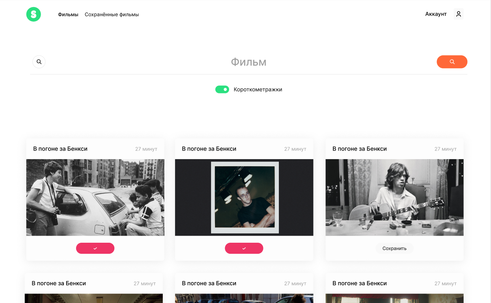

# Проект ["Movies-explorer-frontend"](https://github.com/ArtemSedrakyan/movies-explorer-frontend)

Автор: [Артем Седракян](https://github.com/ArtemSedrakyan)



* Проект представляет собой пользовательскую часть дипломного проекта movies-explorer. Сервис позволяет осуществлять поиск фильмов по названию и длительности, сохранять их в свой профиль, удалять их оттуда.

* **HTML, CSS, JavaScript**

* Для запуска проекта на локальном сервере введите команду:
``` npm run start ```

* [Ссылка на макет](https://disk.yandex.ru/d/ZpSuPWJ35G1wmg)

* [ссылка на pull request level-3](https://github.com/ArtemSedrakyan/movies-explorer-frontend/pull/3)

* [ссылка на фронтенд-часть проекта](https://sedrakyan.movies.nomoredomains.icu)
